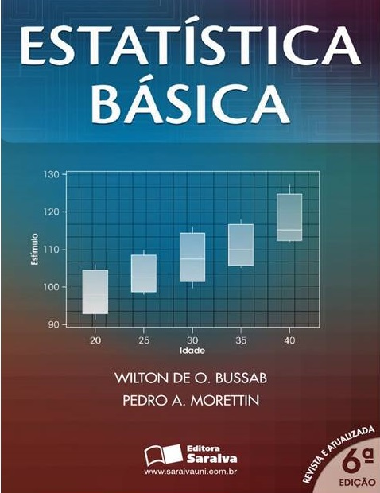

```{r setup, include=FALSE}
options(htmltools.dir.version = FALSE)
knitr::opts_chunk$set(echo = FALSE, 
                      comment = '',
                      message = FALSE,
                      warning = FALSE,
                      cache = TRUE)
```
<style> 
#caixa {
  border: 1px solid;
  padding: 10px;
  box-shadow: 5px 10px blue;
}
div {
  text-align: justify;
  text-justify: inter-word;
}
</style>

# Formação &#127891;

&#10004; Bacharel em Estatística

```{r , echo=FALSE, fig.align = 'center', out.width = '35%'}
knitr::include_graphics('figuras/fct.jpg')
```

<br>

--

&#10004; Mestrado e Doutorado em Ciências

```{r , echo=FALSE, fig.align = 'center', out.width = '45%'}

```

---

# Universidades &#127979;

&#10004; Unoeste

```{r , echo=FALSE, fig.align = 'center', out.width = '25%'}

```

<br>

&#10004; UEM

```{r , echo=FALSE, fig.align = 'center', out.width = '25%'}
knitr::include_graphics('figuras/logo_uem.jpg')
```

<br>

&#10004; UTFPR

```{r , echo=FALSE, fig.align = 'center', out.width = '25%'}
knitr::include_graphics('figuras/utfpr.jpg')
```

---

# Apresentar-se

- Nome, o curso

<br>

- Porque você precisa estudar Estatística?

```{r , echo=FALSE, fig.align = 'right', out.width = '40%'}
knitr::include_graphics('https://media.giphy.com/media/TKNGghpLhaz9XH1tSj/giphy.gif')
```

---

# Porque estudar Estatística &#128526;

<!--acrescentar embed no link dos videos-->

<center>
<iframe width="560" height="315" src="https://www.youtube.com/embed/wV0Ks7aS7YI" frameborder="0" allow="accelerometer; autoplay; encrypted-media; gyroscope; picture-in-picture" allowfullscreen></iframe>
</center>

---

<!-- outra forma de inserir video

# Porque estudar Estatística &#128526;

```{r}
library(vembedr)

embed_url("https://www.youtube.com/watch?v=wV0Ks7aS7YI&t=27s") |> 
  use_rounded() |> 
  use_start_time(10) |> 
  use_align("center")
```

-->

# Importância da Estatística para Engenharia de Química &#129327;

&#10004; **Controle de qualidade**

<br>

--

&#10004; **Emissão de laudos técnicos**

<br>

--

&#10004; **Estudar a viabilidade de novos produtos**

<br>

---

# Objetivo da disciplina &#127919;

<div id="caixa">
 <div>O objetivo é proporcionar aos alunos de graduação em Engenharia de Química uma introdução aos <font color="#0066cc">conceitos de estatística</font> utilizados na análise de dados, bem como o desenvolvimento da capacidade de <font color="#0066cc">interpretar os resultados</font> e estabelecer uma linguagem comum entre o Engenheiro e o Estatístico.</div>
</div>

<br>

.pull-left[
Horário da Aula &#9200;
]
.pull-right[
- Quarta-feira das 10:20--12:00

- Sexta-feira das 10:20--12:00
]

<br>

--

.pull-left[
Horário de Atendimento &#9200;
]
.pull-right[
- Quinta-feira das 16:40-18:20

- Sábado das 11:10-12:00 (*online*)
]

---

# Conteúdo Programático

&#10004; Conceitos básicos de estatística descritiva

```{r , echo=FALSE, fig.align = 'center', out.width = '40%'}
knitr::include_graphics('figuras/fig2.jpg')
```

<br>

--

&#10004; Conceitos básicos de probabilidade

```{r , echo=FALSE, fig.align = 'center', out.width = '40%'}
knitr::include_graphics('figuras/fig3.jpg')
```

---

&#10004; Conceitos básicos Variável aleatória e modelos de distribuição de probabilidade.

```{r , echo=FALSE, fig.align = 'center', out.width = '50%'}
knitr::include_graphics('figuras/fig4.jpg')
```

<br>

--

&#10004; Conceitos básicos de inferência estatística.

```{r , echo=FALSE, fig.align = 'center', out.width = '50%'}
knitr::include_graphics('figuras/fig5.jpg')
```

---

&#10004; Conceitos básicos de estatística experimental.

```{r , echo=FALSE, fig.align = 'center', out.width = '50%'}
knitr::include_graphics('figuras/fig6.jpg')
```

---

# Bibliografia básica

&#10004; BUSSAB, Wilton de Oliveira; MORETTIN, Pedro Alberto. **Estatística básica**. 5ed. São Paulo: Saraiva, 2004. 526 p.

```{r , echo=FALSE, fig.align = 'center', out.width = '35%'}

```

---

# Bibliografia básica

&#10004; MONTGOMERY, Douglas C.; RUNGER, George C. **Estatística aplicada e probabilidade para engenheiros**. 4ed. Rio de Janeiro, RJ: LTC, 2009, 493 p.

```{r , echo=FALSE, fig.align = 'center', out.width = '35%'}
knitr::include_graphics('figuras/fig9.jpg')
```

---

# Bibliografia complementar

- MORETTIN, L.G. **Estatística básica: probabilidade e inferência**, volume único. São Paulo: Pearson Prentice Hall, 2009. 375 p.

<br>

- SPIEGEL, M.R.; SCHILLER, J.J.; SRINIVASAN, R.A. **Teoria e problemas de probabilidade e estatística**. 2.ed. São Paulo: McGraw-Hill, 2004. 398 p.

<br>

- FONSECA, J.S.; MARTINS, G.A. **Curso de estatística**. 6.ed. São Paulo: Atlas, 1996. 320 p. 

---

# Aulas

&#10004; **Participar** da resolução dos exemplos, bem como do desenvolvimento de algum método quando for chamado.

```{r , echo=FALSE, fig.align = 'center', out.width = '30%'}

```


&#10004; **Questionar** quando tiver dúvidas.

---

# Lista de exercícios &#9997;

Haverá listas de exercícios para serem resolvidas em casa. Resolver os problemas da lista de exercícios é uma forma de aprendizagem, pois é uma maneira de colocar em prática tudo que você leu e ouviu, e vai lhe fornecer um *feedback* sobre o que foi abordado em sala de aula.

```{r , echo=FALSE, fig.align = 'center', out.width = '55%'}

```

<br>

--

&#10004; Vocês são **encorajados** a resolver problemas com os outros estudantes, compartilhar e discutir ideias.

--

&#10004; As respostas de cada problema devem ser **resultados de seu próprio esforço**.

---

# Complementação de carga horária

.pull-left[
&#10004; Conceitos básicos de *software* `R`.  

&#10004; Quizzes sobre: distribuição de frequência (tabelas e representação gráfica), outras distribuições de probabilidade contínuas e teste de hipótese para proporção.

&#10004; Leitura.
]
.pull-right[

]

<br>

```{r , echo=FALSE, fig.align = 'right', out.width = '40%'}
knitr::include_graphics('https://media.giphy.com/media/xTiQywlOn0gKyz0l56/giphy.gif')
```

---

# Provas &#128221;

Haverá três avaliações que vão cobrir o conteúdo abordado em sala de aula, as listas de exercícios e as bibliografias citadas. As soluções de cada uma das provas devem estar bem **organizadas** e **justificadas**. Desta forma, você irá demonstrar sua capacidade de comunicar os seus resultados. Se a prova estiver **difícil de compreender** devido a organização e passagens não justificadas, haverá **penalidades**.

Qualquer conflito com as datas das provas devem ser comunicados na **segunda semana de aula**.

<br>

.pull-left[
<center>Prova 1</center>

Sexta-feira, **09/09**
]
.pull-right[
<center>Prova 2</center>

Sexta-feira, **28/10**
]

.pull-left[
<center>Prova 3</center>

Sexta-feira, **02/12**
]
.pull-right[
]

---

# Prova de segunda chamada 

No caso do aluno perder, **por motivo de doença ou força maior**, alguma avaliação, poderá solicitar, através de requerimento, uma única segunda chamada por avaliação, desde que no prazo determinado no Regulamento da Organização Didático-Pedagógica dos Cursos da UTFPR (Art.36 - Graduação e Art.31 - Técnico)

<br>

.pull-left[
<center>Prova de Segunda Chamada</center>

Quarta-feira, **14/12**
]
.pull-right[

]

<br>

Trabalho ou viagem a passeio **não são motivos** para segunda chamada.

---

# Cópia de provas (e/ou *internet*) e falsidade

```{r , echo=FALSE, fig.align = 'center', out.width = '40%'}
knitr::include_graphics('https://media.giphy.com/media/SRqTQmbYdm5jgS7xH9/giphy.gif
')
```

A desonestidade em nosso trabalho acadêmico representa uma **grave violação ética**.

<br>

Para maiores detalhes, consulte o **regulamento disciplinar do corpo discente da UTFPR**

<https://portal.utfpr.edu.br/documentos/graduacao-e-educacao-profissional/prograd/diretrizes-e-regulamentos/gestao/regulamento-disciplinar-do-corpo-discente/view>

---

# Não divulgar informações falsas!

```{r , echo=FALSE, fig.align = 'center', out.width = '50%'}
knitr::include_graphics('https://media.giphy.com/media/3orieNLnAxzZI9CQzm/giphy.gif?cid=ecf05e47gv1g9buos2wnbph6pwbmk45fp0luz268sanoyrru&rid=giphy.gif&ct=g')
```

**Faça questionamentos** sobre as informações a respeito dos tópicos da disciplina. 

**Relembre** o que foi passado em sala de aula.

---

# Critério de avaliação &#128220;

Resolução 122/10-COEPP/Artigo 4:

&#10004; Será aprovado o aluno que obtiver média final maior ou igual a 6 $(MF\geq6)$, em que
		$$MF=(P1+P2+P3)/3,$$
em que $Pi (i=1,2,3)$ é a $i$-ésima avaliação. Para MF poderá ser acrescentado um bônus por engajamento de no **máximo** 0,5 pontos a depender da decisão da turma.

<br>

&#10004; O aluno com $MF<6$ deverá fazer a prova de recuperação (**matéria toda**) no dia 21-12-2022, que substituirá a **menor nota** entre $P1$, $P2$ e $P3.$ Em seguida, a média final será recalculada $(MFr)$ considerando a nota da prova de recuperação. Então, a nota final será determinada pela expressão

$$NF=\min(6,MPr).$$
Será aprovado o aluno com $NF\geq6$.

---

# Espera-se do aluno de graduação 

&#10004; Dedicado com a disciplina.


&#10004; Base de matemática elementar.


&#10004; Conhecimento de derivada e integral. 


&#10004;  Questione e analise de forma racional e inteligente.

```{r , echo=FALSE, fig.align = 'center', out.width = '50%'}
knitr::include_graphics('https://media.giphy.com/media/KM9Oag1SJ7PiyoWUEW/giphy.gif')
```

---

# Refletir

**Eu terei tempo** para me dedicar a disciplina? 

**Minha base matemática do ensino médio** é suficiente a disciplina?

**Aprendi e consigo aplicar os conceitos** de Cálculo I?

<br>

```{r , echo=FALSE, fig.align = 'center', out.width = '40%'}
knitr::include_graphics('https://media.giphy.com/media/xThtanqVawzQNeHD20/giphy.gif')
```

---

# 

&#10004; <https://moodle.utfpr.edu.br/login/index.php>

<br>

&#10004; Londrina - Graduação - Engenharia Química - 2o período

<br>

&#10004; Disciplina: 2022 - S2 - Probabilidade e Estatística

<br>

&#10004; Senha: MA65AEQ2022S2


